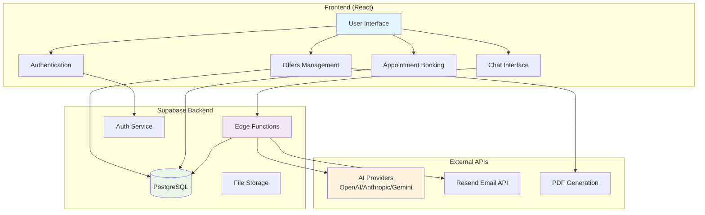
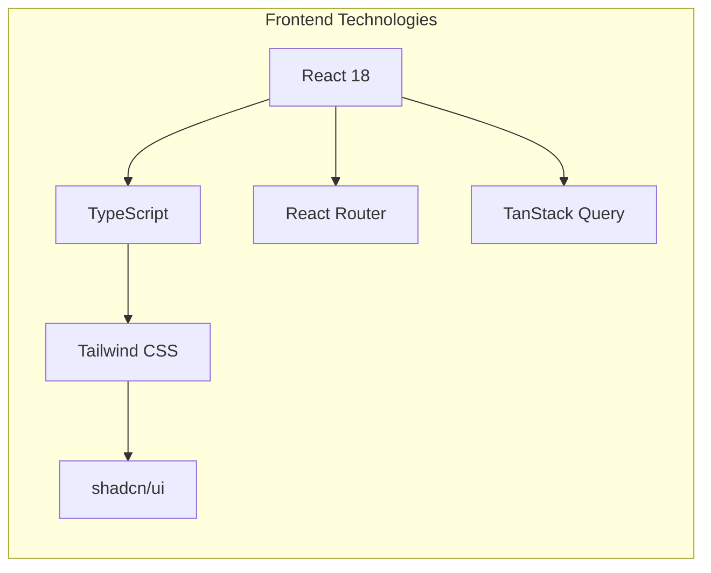
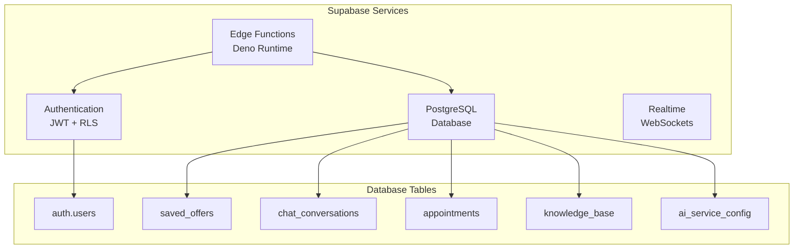
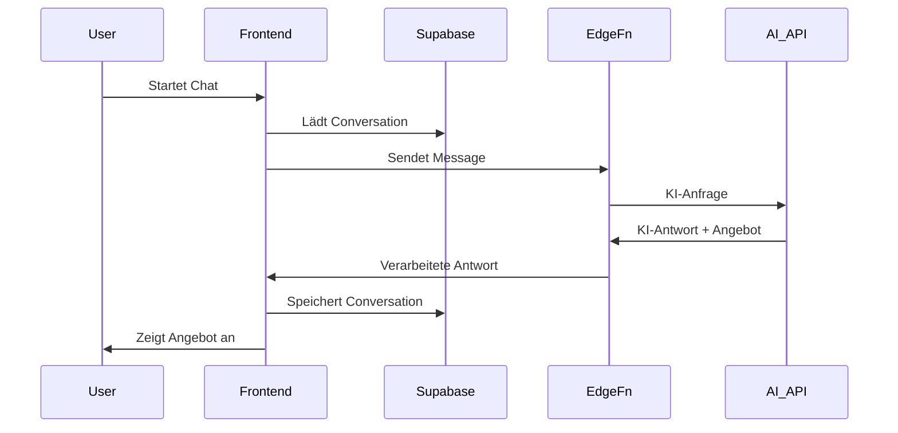
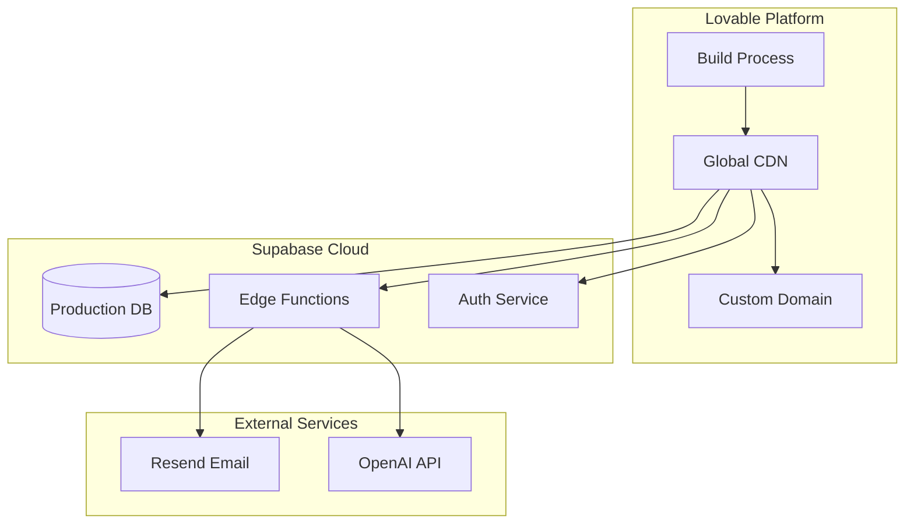

# System-Architektur

## Architektur-Übersicht



## Technologie-Stack Details

### Frontend-Layer


**Komponenten:**
- **React 18**: Moderne UI-Framework mit Hooks und Context
- **TypeScript**: Typsicherheit und bessere Entwicklererfahrung  
- **Tailwind CSS**: Utility-first CSS Framework
- **shadcn/ui**: Wiederverwendbare UI-Komponenten
- **React Router**: Client-side Routing
- **TanStack Query**: Server State Management

### Backend-Layer (Supabase)


### Datenfluss-Architektur


## Sicherheitsarchitektur

### Row Level Security (RLS)
```mermaid
graph TD
    subgraph "RLS Policies"
        UserData[Benutzerdaten<br/>user_id = auth.uid()]
        Offers[Angebote<br/>user_id = auth.uid()]
        Conversations[Gespräche<br/>user_id = auth.uid()]
        Appointments[Termine<br/>user_id = auth.uid()]
    end
    
    subgraph "Public Data"
        Knowledge[Knowledge Base<br/>öffentlich lesbar]
        AIConfig[AI Config<br/>nur Admin]
    end
    
    Auth[Supabase Auth] --> UserData
    Auth --> Offers
    Auth --> Conversations
    Auth --> Appointments
```

### API-Sicherheit
- **JWT-Token**: Automatische Authentifizierung über Supabase
- **CORS-Header**: Konfiguriert für Web-Zugriff
- **API-Key Management**: Sichere Speicherung in Supabase Secrets
- **Rate Limiting**: Über Supabase Edge Functions

## Deployment-Architektur


## Performance-Optimierungen

### Frontend
- **Code Splitting**: Route-basiert mit React.lazy()
- **Memoization**: React.memo für schwere Komponenten
- **Virtual Scrolling**: Für große Listen (Nachrichten)
- **Image Optimization**: Lazy Loading und WebP

### Backend
- **Database Indexing**: Optimierte Queries mit Indizes
- **Connection Pooling**: Automatisch über Supabase
- **Caching**: Browser-Cache für statische Assets
- **Edge Computing**: Globale Verteilung über Supabase

## Skalierbarkeits-Überlegungen

### Horizontal Scaling
- **Stateless Frontend**: Einfache CDN-Verteilung
- **Managed Database**: Automatisches Scaling über Supabase
- **Edge Functions**: Serverless mit automatischem Scaling

### Monitoring & Observability
- **Error Tracking**: Console Logs und Supabase Analytics
- **Performance Monitoring**: Core Web Vitals
- **Database Monitoring**: Supabase Dashboard
- **API Monitoring**: Edge Function Logs

## Nächste Architektur-Schritte

1. 📊 [Datenbank-Design](./05-database.md) verstehen
2. 🔌 [API-Dokumentation](./06-api.md) studieren
3. 🚀 [Deployment-Guide](./07-deployment.md) befolgen
