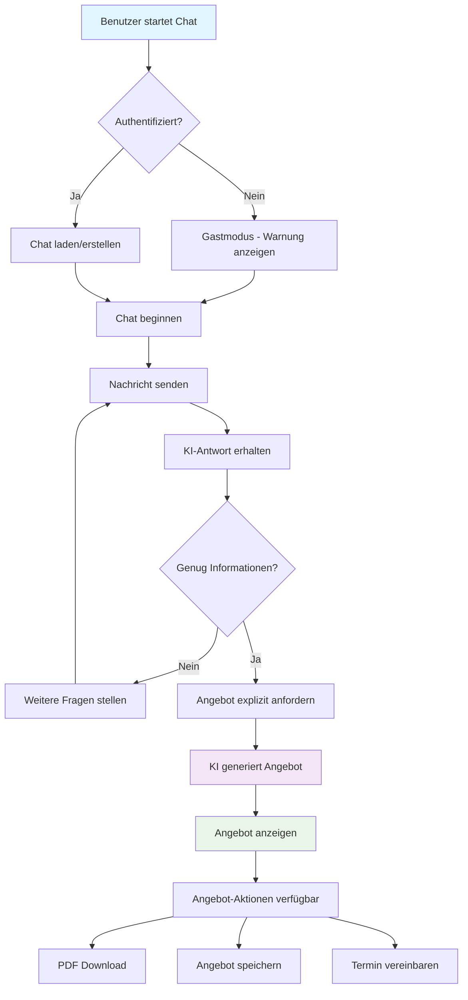
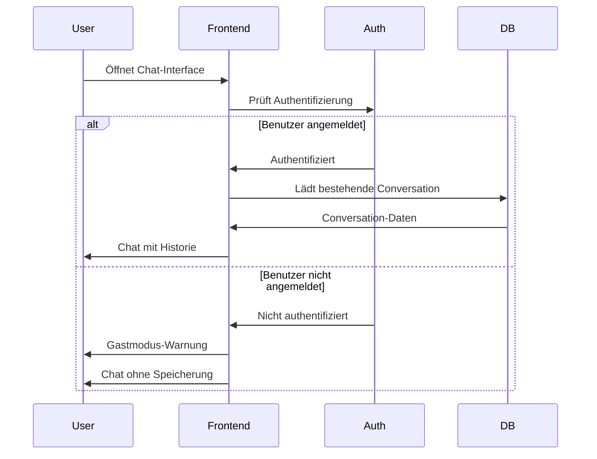
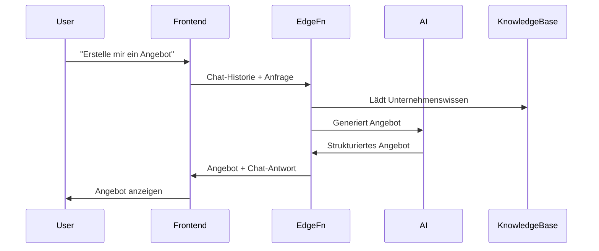
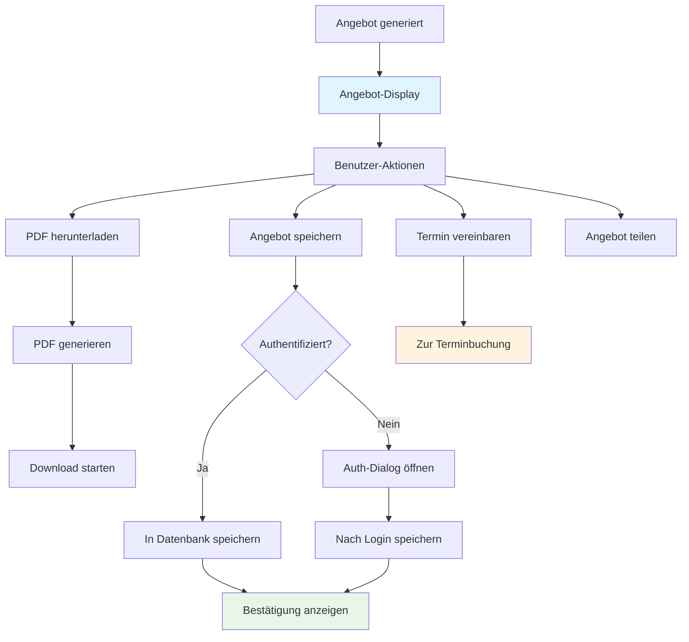
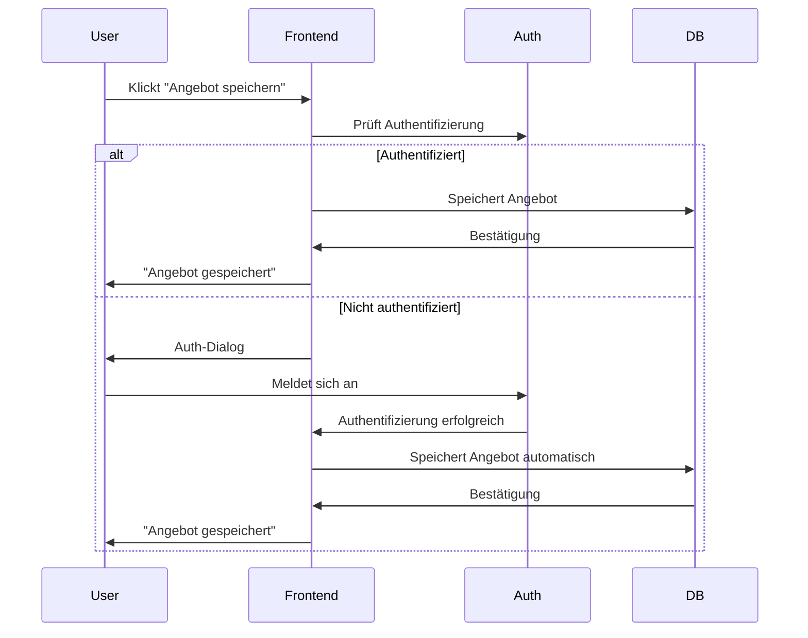
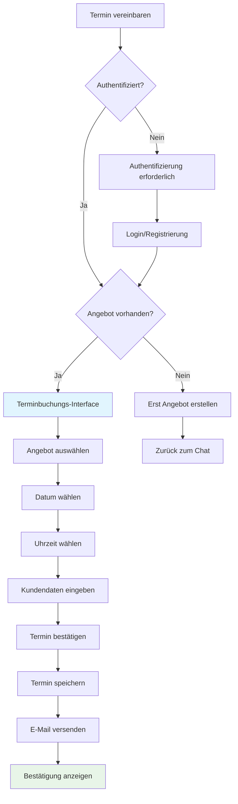
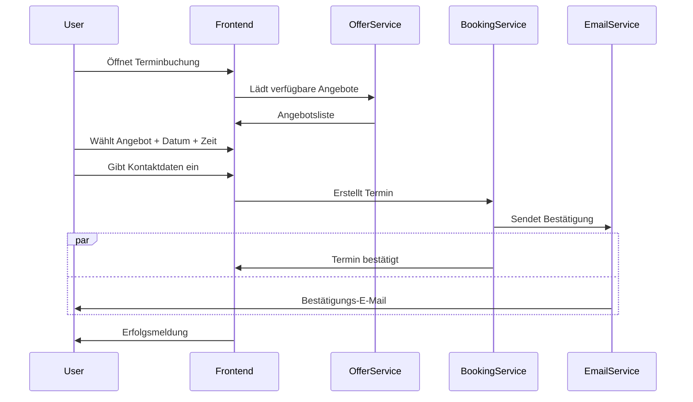
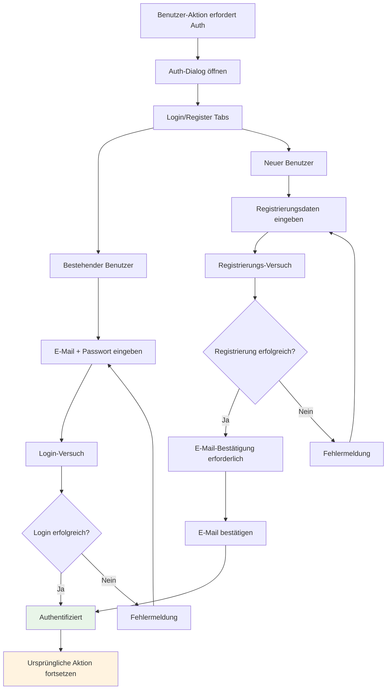
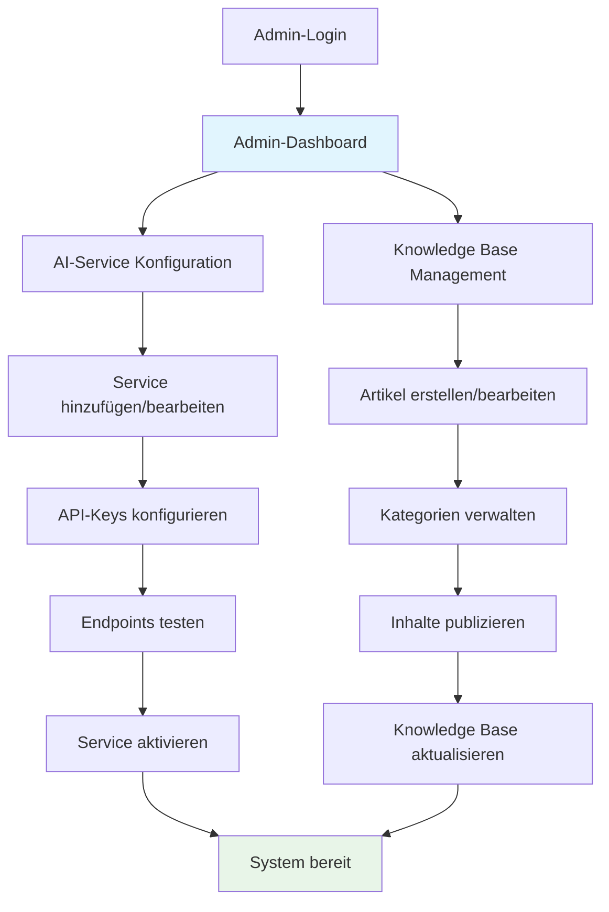

# Benutzer-Workflows

## 1. Chat-zu-Angebot Workflow

Der Hauptworkflow des Systems führt Benutzer von einem initialen Chat zu einem fertigen Angebot.

### Workflow-Details

#### Phase 1: Chat-Initialisierung

#### Phase 2: Angebotsgenerierung

## 2. Angebots-Management Workflow

### Angebot-Speicherung Details

## 3. Terminbuchungs-Workflow

### Detaillierter Buchungsprozess

## 4. Authentifizierungs-Workflow

## 5. Admin-Workflow

## Workflow-Optimierungen

### Performance-Optimierungen
- **Lazy Loading**: Komponenten werden nur bei Bedarf geladen
- **Optimistic Updates**: UI aktualisiert sich vor Server-Bestätigung
- **Background Sync**: Daten werden im Hintergrund synchronisiert

### UX-Optimierungen
- **Progressive Disclosure**: Informationen werden schrittweise enthüllt
- **Smart Defaults**: Vorausgefüllte Formulare basierend auf Kontext
- **Error Recovery**: Klare Fehlermeldungen mit Lösungsvorschlägen

### Accessibility
- **Keyboard Navigation**: Vollständig über Tastatur bedienbar
- **Screen Reader Support**: ARIA-Labels und semantische HTML
- **High Contrast**: Unterstützung für hohen Kontrast

## Nächste Schritte

1. 🧩 [Komponenten-Dokumentation](./04-components.md) verstehen
2. 🗄️ [Datenbank-Design](./05-database.md) studieren
3. 🔧 [Entwickler-Leitfaden](./08-developer-guide.md) befolgen
