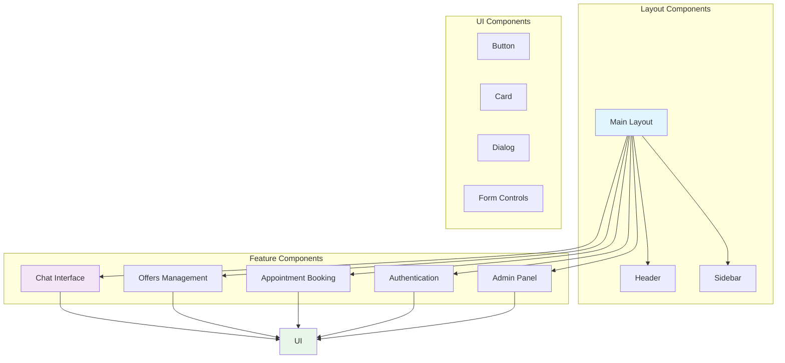
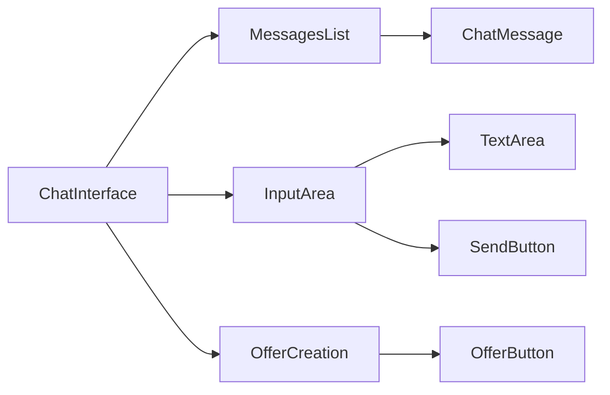
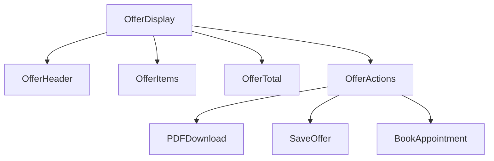
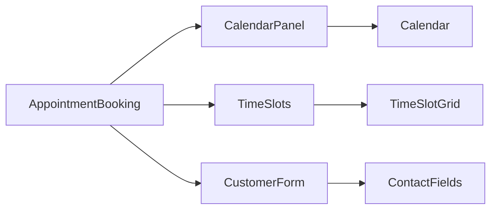
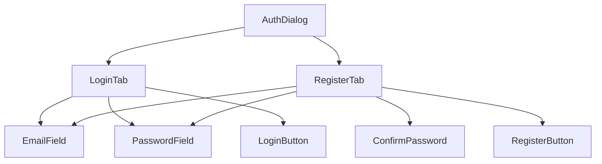
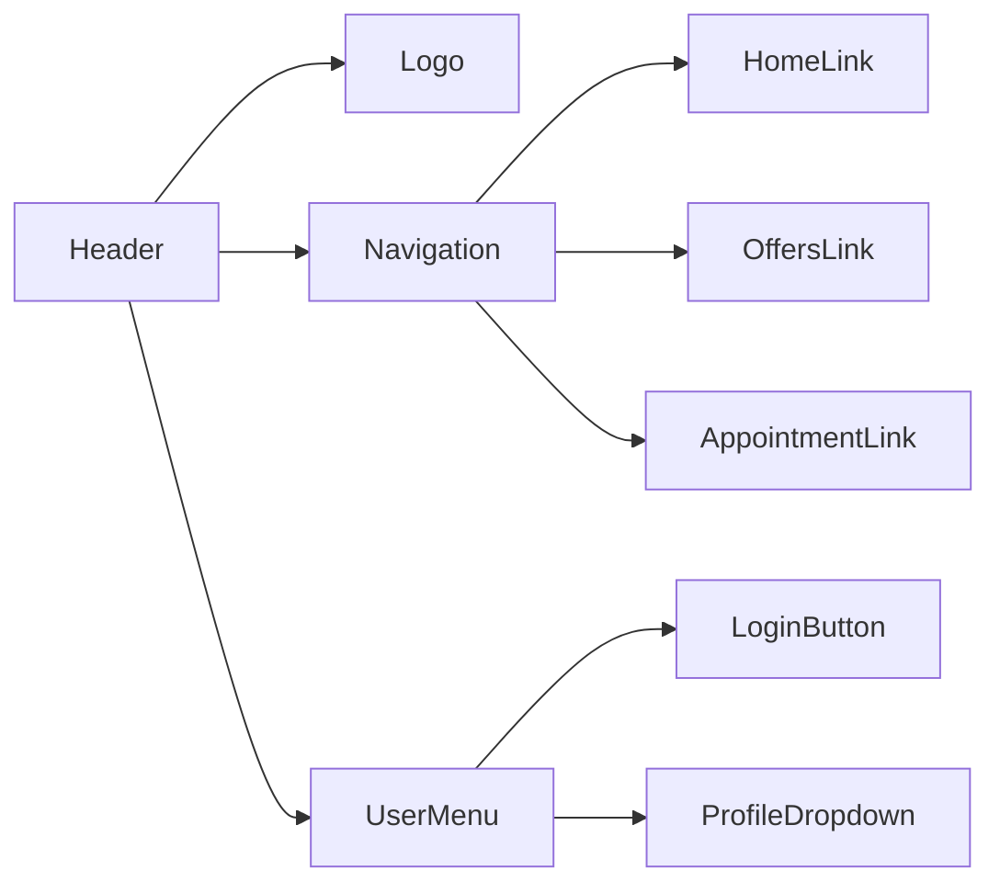

# Komponenten-Dokumentation

## Komponenten-Architektur



## 1. Chat-Interface Komponenten

### ChatInterface (`src/components/chat/ChatInterface.tsx`)

**Zweck**: Hauptkomponente für KI-gestützte Beratungsgespräche



**Eigenschaften**:
- Verwaltung des Nachrichtenverlaufs
- Integration mit KI-Service über Edge Functions
- Automatische Speicherung von Conversations
- Angebotsgenerierung basierend auf Chat-Kontext

**State Management**:
```typescript
interface ChatState {
  messages: Message[];
  isLoading: boolean;
  conversationId: string | null;
}
```

**Wichtige Features**:
- ✅ Nachrichten-Limit (50 pro Conversation)
- ✅ Wort-Zählung für Angebots-Berechtigung
- ✅ Auto-Speicherung für authentifizierte Benutzer
- ✅ Offline-Warnung für Gast-Benutzer

### ChatMessage (`src/components/chat/ChatMessage.tsx`)

**Zweck**: Darstellung einzelner Chat-Nachrichten

**Features**:
- Benutzer vs. Assistent Styling
- Markdown-Rendering für formatierte Inhalte
- Zeitstempel-Anzeige
- Responsive Design

## 2. Angebots-Management Komponenten

### OfferDisplay (`src/components/offers/OfferDisplay.tsx`)

**Zweck**: Anzeige und Verwaltung generierter Angebote



**Funktionalitäten**:
- PDF-Export über jsPDF
- Angebot speichern (mit Auth-Check)
- Weiterleitung zur Terminbuchung
- Responsive Anzeige mit ScrollArea

### OffersList (`src/components/offers/OffersList.tsx`)

**Zweck**: Übersicht gespeicherter Angebote

**Features**:
- Angebots-Karten mit Preisanzeige
- Gültigkeitsdatum-Überwachung
- Lösch-Funktionalität
- Navigation zu Angebots-Details

## 3. Terminbuchungs-Komponenten

### AppointmentBooking (`src/components/appointment/AppointmentBooking.tsx`)

**Zweck**: Vollständiger Terminbuchungs-Workflow



**Workflow**:
1. Angebot auswählen (OfferSelector)
2. Datum wählen (Calendar)
3. Uhrzeit wählen (TimeSlotGrid) 
4. Kundendaten eingeben
5. Bestätigung mit E-Mail-Versand

### OfferSelector (`src/components/appointment/OfferSelector.tsx`)

**Zweck**: Auswahl verfügbarer Angebote für Terminbuchung

**Features**:
- Kombiniert aktuelle Session-Angebote und gespeicherte Angebote
- Zeigt Preise und Gültigkeitsdaten
- Unterscheidet zwischen "Aktuell" und "Gespeichert"

## 4. Authentifizierungs-Komponenten

### AuthDialog (`src/components/auth/AuthDialog.tsx`)

**Zweck**: Modal für Login/Registrierung



**Features**:
- Tab-basierte Navigation zwischen Login/Register
- Supabase Auth Integration
- Fehlerbehandlung und Validierung
- Callback nach erfolgreicher Authentifizierung

## 5. Admin-Panel Komponenten

### AIEndpointManager (`src/components/admin/AIEndpointManager.tsx`)

**Zweck**: Verwaltung von KI-Service Konfigurationen

**Funktionalitäten**:
- CRUD-Operationen für AI-Services
- API-Key Management über Supabase Secrets
- Endpoint-Testing
- System-Prompt Konfiguration

### KnowledgeManager (`src/components/admin/KnowledgeManager.tsx`)

**Zweck**: Verwaltung der Unternehmenswissensbasis

**Features**:
- Artikel erstellen/bearbeiten/löschen
- Kategorisierung von Inhalten
- Rich-Text Editor für Inhalte
- Suchfunktionalität

## 6. Layout-Komponenten

### Header (`src/components/layout/Header.tsx`)

**Zweck**: Hauptnavigation der Anwendung



### Sidebar (`src/components/layout/Sidebar.tsx`)

**Zweck**: Seitliche Navigation (Mobile/Desktop)

**Features**:
- Responsive Verhalten
- Authentifizierungsabhängige Links
- Slide-in Animation
- Touch-Gesten für Mobile

## Komponenten-Konventionen

### File-Structure
```
src/components/
├── chat/                 # Chat-spezifische Komponenten
├── offers/              # Angebots-Komponenten
├── appointment/         # Terminbuchungs-Komponenten  
├── auth/               # Authentifizierungs-Komponenten
├── admin/              # Admin-Panel Komponenten
├── layout/             # Layout-Komponenten
└── ui/                 # Wiederverwendbare UI-Komponenten
```

### Naming Conventions
- **PascalCase** für Komponenten: `ChatInterface`
- **camelCase** für Props: `onOfferGenerated`
- **kebab-case** für CSS-Klassen: `chat-message`
- **UPPER_CASE** für Konstanten: `STORAGE_KEY`

### Props Interface Pattern
```typescript
interface ComponentNameProps {
  // Required props
  requiredProp: string;
  
  // Optional props
  optionalProp?: boolean;
  
  // Event handlers
  onAction?: (data: any) => void;
  
  // Children (wenn nötig)
  children?: React.ReactNode;
}
```

### State Management Pattern
```typescript
const ComponentName = ({ prop }: ComponentNameProps) => {
  // Lokaler State
  const [localState, setLocalState] = useState(initialValue);
  
  // Context
  const { contextValue } = useContext(MyContext);
  
  // Effects
  useEffect(() => {
    // Side effects
  }, [dependencies]);
  
  // Event Handlers
  const handleAction = () => {
    // Handler logic
  };
  
  // Render
  return (
    // JSX
  );
};
```

## Performance-Optimierungen

### React.memo Usage
```typescript
// Für komponenten mit häufigen Re-renders
export const ExpensiveComponent = React.memo(({ data }) => {
  // Component logic
});
```

### useCallback für Event Handlers
```typescript
const handleClick = useCallback(() => {
  // Handler logic
}, [dependencies]);
```

### useMemo für teure Berechnungen
```typescript
const expensiveValue = useMemo(() => {
  return computeExpensiveValue(data);
}, [data]);
```

## Testing-Strategien

### Component Testing
- **Unit Tests**: Isolierte Komponenten-Tests
- **Integration Tests**: Komponenten-Interaktion
- **E2E Tests**: Vollständige Workflows

### Testing Tools
- **Jest**: Test Runner
- **React Testing Library**: Component Testing
- **MSW**: API Mocking
- **Cypress**: E2E Testing

## Nächste Schritte

1. 🗄️ [Datenbank-Design](./05-database.md) verstehen
2. 🔌 [API-Dokumentation](./06-api.md) studieren
3. 🔧 [Entwickler-Leitfaden](./08-developer-guide.md) befolgen
