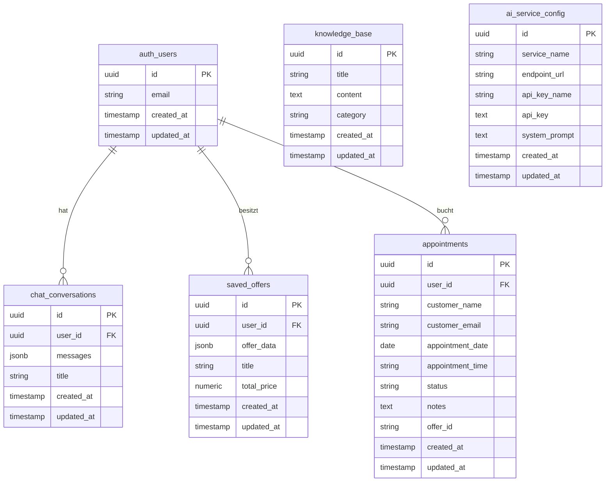
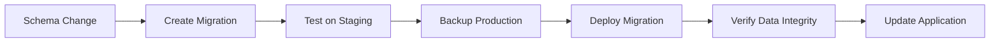

# Datenbank-Design

## Entity-Relationship Diagramm



## Tabellen-Details

### 1. chat_conversations

**Zweck**: Speicherung von Beratungsgesprächen zwischen Benutzern und KI

```sql
CREATE TABLE chat_conversations (
    id UUID PRIMARY KEY DEFAULT gen_random_uuid(),
    user_id UUID NOT NULL REFERENCES auth.users(id),
    messages JSONB NOT NULL DEFAULT '[]',
    title TEXT,
    created_at TIMESTAMP WITH TIME ZONE DEFAULT now(),
    updated_at TIMESTAMP WITH TIME ZONE DEFAULT now()
);
```

**Messages JSON-Struktur**:
```json
[
  {
    "id": "msg-123",
    "content": "Nachrichteninhalt",
    "sender": "user|assistant", 
    "timestamp": "2024-01-01T10:00:00Z"
  }
]
```

**Constraints & Validierung**:
- ✅ Maximale Nachrichten pro Conversation: 50
- ✅ User kann maximal 3 aktive Conversations haben
- ✅ RLS: Benutzer sehen nur eigene Conversations

### 2. saved_offers

**Zweck**: Persistierung generierter Angebote

```sql
CREATE TABLE saved_offers (
    id UUID PRIMARY KEY DEFAULT gen_random_uuid(),
    user_id UUID NOT NULL REFERENCES auth.users(id),
    offer_data JSONB NOT NULL,
    title TEXT NOT NULL,
    total_price NUMERIC NOT NULL,
    created_at TIMESTAMP WITH TIME ZONE DEFAULT now(),
    updated_at TIMESTAMP WITH TIME ZONE DEFAULT now()
);
```

**Offer Data JSON-Struktur**:
```json
{
  "id": "offer-123",
  "title": "Angebots-Titel",
  "description": "Beschreibung",
  "items": [
    {
      "name": "Leistung 1",
      "description": "Beschreibung der Leistung",
      "price": 150.00,
      "quantity": 2
    }
  ],
  "totalPrice": 1500.00,
  "validUntil": "2024-12-31T23:59:59Z"
}
```

**Features**:
- ✅ Automatische Bereinigung abgelaufener Angebote
- ✅ Volltext-Suche über Titel und Beschreibung
- ✅ RLS: Benutzer sehen nur eigene Angebote

### 3. appointments

**Zweck**: Verwaltung von Beratungsterminen

```sql
CREATE TABLE appointments (
    id UUID PRIMARY KEY DEFAULT gen_random_uuid(),
    user_id UUID NOT NULL REFERENCES auth.users(id),
    customer_name TEXT NOT NULL,
    customer_email TEXT NOT NULL,
    appointment_date DATE NOT NULL,
    appointment_time TEXT NOT NULL,
    status TEXT NOT NULL DEFAULT 'scheduled',
    notes TEXT,
    offer_id TEXT,
    created_at TIMESTAMP WITH TIME ZONE DEFAULT now(),
    updated_at TIMESTAMP WITH TIME ZONE DEFAULT now()
);
```

**Status-Werte**:
- `scheduled`: Termin geplant
- `confirmed`: Termin bestätigt  
- `completed`: Termin abgeschlossen
- `cancelled`: Termin abgesagt

**Business Rules**:
- ✅ Keine Termine in der Vergangenheit
- ✅ Keine Termine an Wochenenden
- ✅ Arbeitszeiten: 9:00-17:00 Uhr
- ✅ E-Mail-Bestätigung bei Buchung

### 4. knowledge_base

**Zweck**: Unternehmenswissen für KI-Beratung

```sql
CREATE TABLE knowledge_base (
    id UUID PRIMARY KEY DEFAULT gen_random_uuid(),
    title TEXT NOT NULL,
    content TEXT NOT NULL,
    category TEXT,
    created_at TIMESTAMP WITH TIME ZONE DEFAULT now(),
    updated_at TIMESTAMP WITH TIME ZONE DEFAULT now()
);
```

**Kategorien**:
- `services`: Dienstleistungen
- `pricing`: Preismodelle
- `processes`: Geschäftsprozesse
- `faq`: Häufige Fragen
- `policies`: Richtlinien

**Features**:
- ✅ Volltext-Suche über Titel und Inhalt
- ✅ Kategoriebasierte Filterung
- ✅ Versionierung durch created_at/updated_at

### 5. ai_service_config

**Zweck**: Konfiguration verschiedener KI-Anbieter

```sql
CREATE TABLE ai_service_config (
    id UUID PRIMARY KEY DEFAULT gen_random_uuid(),
    service_name TEXT NOT NULL,
    endpoint_url TEXT NOT NULL,
    api_key_name TEXT NOT NULL,
    api_key TEXT,
    system_prompt TEXT,
    created_at TIMESTAMP WITH TIME ZONE DEFAULT now(),
    updated_at TIMESTAMP WITH TIME ZONE DEFAULT now()
);
```

**Unterstützte Services**:
- OpenAI (GPT-3.5/4)
- Anthropic (Claude)
- Google (Gemini)
- Custom Endpoints

## Row Level Security (RLS)

### Sicherheitsmuster

```mermaid
graph TD
    subgraph "Benutzer-Daten (RLS aktiv)"
        Conversations[chat_conversations<br/>user_id = auth.uid()]
        Offers[saved_offers<br/>user_id = auth.uid()]
        Appointments[appointments<br/>user_id = auth.uid()]
    end
    
    subgraph "Öffentliche Daten"
        Knowledge[knowledge_base<br/>Nur Lesen]
    end
    
    subgraph "Admin-Daten"
        AIConfig[ai_service_config<br/>Nur Admin]
    end
    
    Auth[Supabase Auth] --> Conversations
    Auth --> Offers
    Auth --> Appointments
```

### RLS-Policies Beispiele

```sql
-- Conversations: Benutzer sehen nur eigene
CREATE POLICY "Users can view own conversations" 
ON chat_conversations FOR SELECT 
USING (auth.uid() = user_id);

CREATE POLICY "Users can create own conversations" 
ON chat_conversations FOR INSERT 
WITH CHECK (auth.uid() = user_id);

-- Offers: Benutzer verwalten nur eigene
CREATE POLICY "Users can manage own offers" 
ON saved_offers FOR ALL 
USING (auth.uid() = user_id);

-- Knowledge Base: Öffentlich lesbar
CREATE POLICY "Knowledge base is publicly readable" 
ON knowledge_base FOR SELECT 
TO authenticated 
USING (true);
```

## Datenbank-Funktionen

### 1. Nachrichten-Limit Validation

```sql
CREATE OR REPLACE FUNCTION check_message_limit()
RETURNS TRIGGER AS $$
BEGIN
  IF jsonb_array_length(NEW.messages) > 50 THEN
    RAISE EXCEPTION 'Conversation cannot have more than 50 messages';
  END IF;
  RETURN NEW;
END;
$$ LANGUAGE plpgsql;

CREATE TRIGGER validate_message_limit
  BEFORE INSERT OR UPDATE ON chat_conversations
  FOR EACH ROW EXECUTE FUNCTION check_message_limit();
```

### 2. Conversation-Limit Validation

```sql
CREATE OR REPLACE FUNCTION check_conversation_limit()
RETURNS TRIGGER AS $$
BEGIN
  IF (SELECT COUNT(*) FROM chat_conversations WHERE user_id = NEW.user_id) >= 3 THEN
    RAISE EXCEPTION 'User cannot have more than 3 conversations';
  END IF;
  RETURN NEW;
END;
$$ LANGUAGE plpgsql;
```

### 3. Expired Offers Cleanup

```sql
CREATE OR REPLACE FUNCTION cleanup_expired_offers()
RETURNS void AS $$
BEGIN
  DELETE FROM saved_offers 
  WHERE (offer_data->>'validUntil')::timestamp < now();
END;
$$ LANGUAGE plpgsql;
```

## Indexierung

### Performance-Indizes

```sql
-- Chat Conversations
CREATE INDEX idx_conversations_user_id ON chat_conversations(user_id);
CREATE INDEX idx_conversations_created_at ON chat_conversations(created_at DESC);

-- Saved Offers  
CREATE INDEX idx_offers_user_id ON saved_offers(user_id);
CREATE INDEX idx_offers_valid_until ON saved_offers USING BTREE ((offer_data->>'validUntil'));

-- Appointments
CREATE INDEX idx_appointments_user_id ON appointments(user_id);
CREATE INDEX idx_appointments_date ON appointments(appointment_date);
CREATE INDEX idx_appointments_status ON appointments(status);

-- Knowledge Base
CREATE INDEX idx_knowledge_category ON knowledge_base(category);
CREATE INDEX idx_knowledge_search ON knowledge_base USING GIN (to_tsvector('german', title || ' ' || content));
```

## Daten-Migration Strategien

### Migration-Workflow



### Versionierung
- **Schema Versioning**: Supabase Migration System
- **Data Versioning**: Trigger-basierte Audit-Logs
- **Rollback Strategy**: Automated Backups + Manual Scripts

## Monitoring & Analytics

### Wichtige Metriken
- **Conversation-Länge**: Durchschnittliche Anzahl Nachrichten
- **Angebots-Conversion**: Chat → Angebot → Termin
- **Database Performance**: Query-Zeiten und Indizierung
- **Storage Growth**: Tabellengröße über Zeit

### Überwachung
```sql
-- Aktive Conversations
SELECT COUNT(*) FROM chat_conversations 
WHERE updated_at > now() - interval '24 hours';

-- Angebots-Conversion Rate
SELECT 
  COUNT(DISTINCT c.user_id) as chat_users,
  COUNT(DISTINCT o.user_id) as offer_users,
  COUNT(DISTINCT a.user_id) as appointment_users
FROM chat_conversations c
FULL OUTER JOIN saved_offers o ON c.user_id = o.user_id
FULL OUTER JOIN appointments a ON c.user_id = a.user_id;
```

## Backup & Recovery

### Backup-Strategie
- **Automatische Backups**: Täglich über Supabase
- **Point-in-Time Recovery**: 7 Tage Historie
- **Export-Funktionen**: CSV/JSON für kritische Daten

### Recovery-Procedures
1. **Data Loss**: Restore from latest backup
2. **Corruption**: Point-in-time recovery
3. **Schema Issues**: Migration rollback

## Nächste Schritte

1. 🔌 [API-Dokumentation](./06-api.md) verstehen
2. 🚀 [Deployment-Guide](./07-deployment.md) befolgen  
3. 🔧 [Entwickler-Leitfaden](./08-developer-guide.md) studieren
