# API-Dokumentation

## API-Architektur Übersicht


## 1. Edge Functions

### 1.1 chat-with-ai

**Endpoint**: `POST /functions/v1/chat-with-ai`

**Zweck**: KI-gestützte Beratungsgespräche mit Angebotsgenerierung


**Request Body**:
```typescript
interface ChatRequest {
  message: string;
  context: Message[];
  provider: 'openai' | 'anthropic' | 'gemini';
  config: {
    id: string;
    name: string;
    endpoint_url: string;
    api_key: string;
    system_prompt: string;
  };
  knowledgeBase?: string;
}
```

**Response**:
```typescript
interface ChatResponse {
  message: string;
  offer?: {
    id: string;
    title: string;
    description: string;
    items: OfferItem[];
    totalPrice: number;
    validUntil: string;
  };
}
```

**Error Handling**:
```typescript
// 400 - Ungültige Request-Parameter
// 401 - Authentifizierung fehlgeschlagen
// 500 - AI-Service Fehler
// 503 - Service temporär nicht verfügbar
```

### 1.2 send-appointment-confirmation

**Endpoint**: `POST /functions/v1/send-appointment-confirmation`

**Zweck**: E-Mail-Bestätigung für Terminbuchungen

**Request Body**:
```typescript
interface AppointmentEmailRequest {
  customerEmail: string;
  customerName: string;
  appointmentDate: string;
  appointmentTime: string;
  offerTitle: string;
  offerPrice: string;
  companyName: string;
  companyAddress: string;
  companyPhone: string;
  companyEmail: string;
}
```

**Response**:
```typescript
interface EmailResponse {
  id: string;
  message: string;
}
```

### 1.3 cleanup-expired-offers

**Endpoint**: `POST /functions/v1/cleanup-expired-offers`

**Zweck**: Automatische Bereinigung abgelaufener Angebote

**Features**:
- Wird periodisch ausgeführt
- Löscht Angebote nach Ablaufdatum
- Keine Request-Parameter erforderlich

## 2. Database API (Supabase Client)

### 2.1 Chat Conversations Service

```typescript
// Neue Conversation erstellen
const saveConversation = async (messages: Message[]) => {
  const { data, error } = await supabase
    .from('chat_conversations')
    .insert({
      user_id: user.id,
      messages: messages,
      title: generatedTitle
    })
    .select()
    .single();
};

// Conversation aktualisieren
const updateConversation = async (id: string, messages: Message[]) => {
  const { data, error } = await supabase
    .from('chat_conversations')
    .update({ 
      messages: messages,
      updated_at: new Date().toISOString()
    })
    .eq('id', id);
};

// Benutzer-Conversations laden
const getUserConversation = async () => {
  const { data, error } = await supabase
    .from('chat_conversations')
    .select('*')
    .order('updated_at', { ascending: false })
    .limit(1)
    .maybeSingle();
};
```

### 2.2 Offers Service

```typescript
// Angebot speichern
const saveOffer = async (offer: Offer) => {
  const { data, error } = await supabase
    .from('saved_offers')
    .insert({
      user_id: user.id,
      offer_data: offer,
      title: offer.title,
      total_price: offer.totalPrice
    });
};

// Gespeicherte Angebote laden
const getSavedOffers = async () => {
  const { data, error } = await supabase
    .from('saved_offers')
    .select('*')
    .order('created_at', { ascending: false });
};

// Angebot löschen
const deleteSavedOffer = async (offerId: string) => {
  const { error } = await supabase
    .from('saved_offers')
    .delete()
    .eq('id', offerId);
};
```

### 2.3 Appointments Service

```typescript
// Termin speichern
const saveAppointment = async (data: AppointmentData) => {
  const { data: appointment, error } = await supabase
    .from('appointments')
    .insert({
      user_id: user.id,
      customer_name: data.customerName,
      customer_email: data.customerEmail,
      appointment_date: data.appointmentDate.toISOString().split('T')[0],
      appointment_time: data.appointmentTime,
      offer_id: data.offerId,
      notes: data.notes
    });
};

// Termine laden
const getAppointments = async () => {
  const { data, error } = await supabase
    .from('appointments')
    .select('*')
    .order('appointment_date', { ascending: true });
};

// Termin-Status aktualisieren
const updateAppointmentStatus = async (id: string, status: string) => {
  const { data, error } = await supabase
    .from('appointments')
    .update({ status })
    .eq('id', id);
};
```

## 3. Authentication API

### 3.1 Benutzer-Authentifizierung

```typescript
// Registrierung
const signUp = async (email: string, password: string) => {
  const { data, error } = await supabase.auth.signUp({
    email,
    password,
    options: {
      emailRedirectTo: `${window.location.origin}/auth/success`
    }
  });
};

// Anmeldung
const signIn = async (email: string, password: string) => {
  const { data, error } = await supabase.auth.signInWithPassword({
    email,
    password
  });
};

// Abmeldung
const signOut = async () => {
  const { error } = await supabase.auth.signOut();
};

// Session überwachen
supabase.auth.onAuthStateChange((event, session) => {
  if (event === 'SIGNED_IN') {
    setUser(session?.user ?? null);
  } else if (event === 'SIGNED_OUT') {
    setUser(null);
  }
});
```

### 3.2 Session Management

```typescript
// Aktuelle Session abrufen
const getSession = async () => {
  const { data: { session }, error } = await supabase.auth.getSession();
  return session;
};

// Session erneuern
const refreshSession = async () => {
  const { data, error } = await supabase.auth.refreshSession();
  return data.session;
};
```

## 4. Error Handling

### 4.1 Error-Typen

```typescript
interface APIError {
  message: string;
  code?: string;
  details?: any;
}

// Supabase Errors
interface SupabaseError {
  message: string;
  code: string;
  hint?: string;
}

// Edge Function Errors
interface EdgeFunctionError {
  error: string;
  details?: string;
}
```

### 4.2 Error-Handler Pattern

```typescript
const handleAPIError = (error: any): string => {
  if (error?.code === 'PGRST116') {
    return 'Datensatz nicht gefunden';
  }
  
  if (error?.message?.includes('Row Level Security')) {
    return 'Keine Berechtigung für diese Aktion';
  }
  
  if (error?.code === '23505') {
    return 'Dieser Eintrag existiert bereits';
  }
  
  return error?.message || 'Ein unbekannter Fehler ist aufgetreten';
};
```

## 5. Rate Limiting & Performance

### 5.1 Rate Limits

```mermaid
graph TB
    subgraph "Rate Limits"
        Auth[Auth: 100 req/min]
        DB[Database: 1000 req/min]
        EdgeFn[Edge Functions: 500 req/min]
        External[External APIs: Provider abhängig]
    end
    
    subgraph "Mitigation"
        Cache[Client-side Caching]
        Debounce[Input Debouncing]
        Batch[Request Batching]
        Retry[Exponential Backoff]
    end
    
    Auth --> Cache
    DB --> Batch
    EdgeFn --> Debounce
    External --> Retry
```



### 5.2 Caching-Strategien

```typescript
// React Query für Server State
const { data: offers, isLoading } = useQuery({
  queryKey: ['saved-offers'],
  queryFn: getSavedOffers,
  staleTime: 5 * 60 * 1000, // 5 Minuten
  cacheTime: 10 * 60 * 1000 // 10 Minuten
});

// Local Storage für Session Data
const cacheConversation = (conversation: Conversation) => {
  const key = `conversation_${user.id}`;
  localStorage.setItem(key, JSON.stringify(conversation));
};
```

## 6. API-Testing

### 6.1 Unit Tests

```typescript
// Service Tests
describe('offersService', () => {
  it('should save offer successfully', async () => {
    const mockOffer = createMockOffer();
    const result = await saveOffer(mockOffer);
    
    expect(result).toBeDefined();
    expect(result.title).toBe(mockOffer.title);
  });
});
```

### 6.2 Integration Tests

```typescript
// Edge Function Tests
describe('chat-with-ai', () => {
  it('should generate offer from chat', async () => {
    const response = await supabase.functions.invoke('chat-with-ai', {
      body: {
        message: 'Erstelle mir ein Angebot',
        context: mockChatHistory,
        provider: 'openai'
      }
    });
    
    expect(response.data.offer).toBeDefined();
  });
});
```

## 7. API-Security

### 7.1 Authentifizierung


### 7.2 Input Validation

```typescript
// Zod Schema Validation
const appointmentSchema = z.object({
  customerName: z.string().min(2).max(100),
  customerEmail: z.string().email(),
  appointmentDate: z.date().min(new Date()),
  appointmentTime: z.string().regex(/^\d{2}:\d{2}$/)
});

const validateAppointment = (data: any) => {
  return appointmentSchema.parse(data);
};
```

## 8. API-Monitoring

### 8.1 Metriken

- **Response Times**: Durchschnittliche API-Antwortzeiten
- **Error Rates**: Fehlerquote pro Endpoint
- **Usage Patterns**: API-Nutzung über Zeit
- **Resource Consumption**: CPU/Memory bei Edge Functions

### 8.2 Logging

```typescript
// Structured Logging in Edge Functions
console.log(JSON.stringify({
  timestamp: new Date().toISOString(),
  level: 'INFO',
  message: 'Chat request processed',
  userId: session?.user?.id,
  provider: activeProvider,
  responseTime: Date.now() - startTime
}));
```

## Nächste Schritte

1. 🚀 [Deployment-Guide](./07-deployment.md) befolgen
2. 🔧 [Entwickler-Leitfaden](./08-developer-guide.md) studieren
3. 📋 [Zurück zur Übersicht](./README.md)
