# Deployment & Konfiguration

## Deployment-Architektur


## 1. Lovable Platform Deployment

### 1.1 Automatisches Deployment

Das System wird automatisch über die Lovable-Plattform deployed:


**Features**:
- ✅ **Zero-Config**: Keine manuellen Build-Schritte
- ✅ **Instant Preview**: Live-Vorschau bei Code-Änderungen
- ✅ **Global CDN**: Weltweite Verfügbarkeit
- ✅ **HTTPS**: Automatische SSL-Zertifikate
- ✅ **Custom Domains**: Eigene Domain-Anbindung möglich

### 1.2 Build-Konfiguration

Die Build-Konfiguration erfolgt über `vite.config.ts`:

```typescript
export default defineConfig({
  plugins: [react()],
  optimizeDeps: {
    exclude: ["lucide-react"],
  },
  build: {
    sourcemap: true,
    rollupOptions: {
      output: {
        manualChunks: {
          vendor: ['react', 'react-dom'],
          ui: ['@radix-ui/react-dialog', '@radix-ui/react-select']
        }
      }
    }
  }
});
```

## 2. Supabase-Konfiguration

### 2.1 Projekt-Setup

```bash
# Supabase Projekt-Details
Project ID: rwluonpgnqbnmtyidvyr
URL: https://rwluonpgnqbnmtyidvyr.supabase.co
Anon Key: eyJhbGciOiJIUzI1NiIsInR5cCI6IkpXVCJ9...
```

### 2.2 Datenbank-Migration

```sql
-- Basis-Tabellen erstellen
CREATE TABLE chat_conversations (
  id UUID PRIMARY KEY DEFAULT gen_random_uuid(),
  user_id UUID NOT NULL REFERENCES auth.users(id),
  messages JSONB NOT NULL DEFAULT '[]',
  title TEXT,
  created_at TIMESTAMP WITH TIME ZONE DEFAULT now(),
  updated_at TIMESTAMP WITH TIME ZONE DEFAULT now()
);

-- RLS aktivieren
ALTER TABLE chat_conversations ENABLE ROW LEVEL SECURITY;

-- Policies erstellen
CREATE POLICY "Users can view own conversations" 
ON chat_conversations FOR SELECT 
USING (auth.uid() = user_id);
```

### 2.3 Edge Functions Deployment

Edge Functions werden automatisch mit dem Code deployed:

```
supabase/functions/
├── chat-with-ai/
│   └── index.ts
├── send-appointment-confirmation/
│   └── index.ts
└── cleanup-expired-offers/
    └── index.ts
```

## 3. Umgebungsvariablen & Secrets

### 3.1 Supabase Secrets


**Secrets konfigurieren**:
1. Supabase Dashboard → Settings → Edge Functions → Secrets
2. Oder über Admin-Panel in der Anwendung
3. Verwendung in Edge Functions:

```typescript
const apiKey = Deno.env.get("OPENAI_API_KEY");
if (!apiKey) {
  throw new Error("OpenAI API key not configured");
}
```

### 3.2 Frontend-Konfiguration

```typescript
// src/integrations/supabase/client.ts
const SUPABASE_URL = "https://rwluonpgnqbnmtyidvyr.supabase.co";
const SUPABASE_PUBLISHABLE_KEY = "eyJhbGciOiJIUzI1NiIs...";

export const supabase = createClient(SUPABASE_URL, SUPABASE_PUBLISHABLE_KEY, {
  auth: {
    storage: localStorage,
    persistSession: true,
    autoRefreshToken: true,
    detectSessionInUrl: true
  }
});
```

## 4. Email-Konfiguration (Resend)

### 4.1 Resend Setup


**Setup-Schritte**:
1. **Account erstellen**: https://resend.com
2. **Domain verifizieren**: https://resend.com/domains
3. **API Key erstellen**: https://resend.com/api-keys
4. **Secret konfigurieren**: In Supabase Secrets `RESEND_API_KEY`

### 4.2 Email-Templates

```typescript
// Template-Struktur
const emailTemplate = {
  from: "Digitalwert <service@digitalwert.de>",
  to: [customerEmail],
  subject: "Terminbestätigung - Digitalwert",
  html: `
    <h1>Terminbestätigung</h1>
    <p>Liebe/r ${customerName},</p>
    <p>Ihr Termin wurde erfolgreich gebucht:</p>
    <ul>
      <li><strong>Datum:</strong> ${appointmentDate}</li>
      <li><strong>Uhrzeit:</strong> ${appointmentTime}</li>
      <li><strong>Angebot:</strong> ${offerTitle}</li>
    </ul>
  `
};
```

## 5. KI-Provider Konfiguration

### 5.1 Multi-Provider Setup


### 5.2 Provider-Konfiguration

```typescript
// Beispiel-Konfiguration in der Datenbank
const aiServiceConfig = {
  service_name: "OpenAI GPT-4",
  endpoint_url: "https://api.openai.com/v1/chat/completions",
  api_key_name: "OPENAI_API_KEY",
  system_prompt: "Sie sind ein hilfsreicher KI-Berater..."
};
```

## 6. Domain & SSL

### 6.1 Custom Domain Setup


**Schritte**:
1. **Domain registrieren**: Bei beliebigem Provider
2. **DNS konfigurieren**: CNAME auf Lovable-Subdomain
3. **Lovable konfigurieren**: Project Settings → Domains
4. **SSL-Zertifikat**: Automatisch über Let's Encrypt

### 6.2 Subdomain-Konfiguration

```dns
# DNS-Records Beispiel
CNAME   app.digitalwert.de    yourproject.lovable.app
CNAME   www.digitalwert.de    yourproject.lovable.app
```

## 7. Performance-Optimierung

### 7.1 Frontend-Optimierung

```typescript
// Code Splitting
const OffersPage = lazy(() => import('@/pages/Offers'));
const AppointmentPage = lazy(() => import('@/pages/Appointment'));

// Asset Optimization
const optimizedImages = {
  format: 'webp',
  quality: 85,
  sizes: [320, 768, 1024, 1920]
};
```

### 7.2 Database-Optimierung

```sql
-- Performance-Indizes
CREATE INDEX CONCURRENTLY idx_conversations_user_updated 
ON chat_conversations(user_id, updated_at DESC);

CREATE INDEX CONCURRENTLY idx_offers_user_created 
ON saved_offers(user_id, created_at DESC);

-- Partitionierung für große Tabellen
CREATE TABLE chat_conversations_2024 
PARTITION OF chat_conversations 
FOR VALUES FROM ('2024-01-01') TO ('2025-01-01');
```

## 8. Monitoring & Logging

### 8.1 Application Monitoring


### 8.2 Log-Aggregation

```typescript
// Structured Logging
const logEvent = (event: string, data: any) => {
  console.log(JSON.stringify({
    timestamp: new Date().toISOString(),
    event,
    data,
    userId: user?.id,
    sessionId: sessionId
  }));
};
```

## 9. Backup & Recovery

### 9.1 Backup-Strategie

```mermaid
graph TD
    subgraph "Automatische Backups"
        Daily[Tägliche DB-Backups]
        PITR[Point-in-Time Recovery]
        Config[Konfiguration-Backup]
    end
    
    subgraph "Manuell"
        Export[Daten-Export]
        Code[Code-Versionierung]
        Secrets[Secrets-Backup]
    end
    
    Daily --> Storage[Supabase Storage]
    PITR --> Storage
    Config --> Git[Git Repository]
    Export --> Local[Lokale Kopien]
```



### 9.2 Recovery-Prozeduren

```sql
-- Point-in-Time Recovery
SELECT * FROM your_table 
WHERE created_at <= '2024-01-01 12:00:00';

-- Backup-Export
\copy (SELECT * FROM chat_conversations) TO 'conversations_backup.csv' CSV HEADER;
```

## 10. CI/CD Pipeline

### 10.1 Deployment-Workflow


### 10.2 Quality Gates

- ✅ **TypeScript**: Keine Type-Errors
- ✅ **Linting**: ESLint-Regeln erfüllt
- ✅ **Tests**: Unit Tests bestehen
- ✅ **Build**: Erfolgreicher Build
- ✅ **Performance**: Core Web Vitals < Threshold

## 11. Troubleshooting

### 11.1 Häufige Deployment-Probleme

```typescript
// 1. Supabase Connection Issues
const testConnection = async () => {
  try {
    const { data, error } = await supabase.from('test').select('*').limit(1);
    console.log('Supabase connection:', error ? 'Failed' : 'Success');
  } catch (e) {
    console.error('Connection test failed:', e);
  }
};

// 2. Edge Function Debugging
const debugEdgeFunction = async () => {
  const { data, error } = await supabase.functions.invoke('test-function', {
    body: { debug: true }
  });
  console.log('Edge function response:', { data, error });
};
```

### 11.2 Performance-Debugging

```typescript
// Performance Monitoring
const performanceObserver = new PerformanceObserver((list) => {
  list.getEntries().forEach((entry) => {
    if (entry.entryType === 'navigation') {
      console.log('Page Load Time:', entry.loadEventEnd - entry.fetchStart);
    }
  });
});
performanceObserver.observe({ entryTypes: ['navigation'] });
```

## 12. Checkliste für Deployment

### 12.1 Pre-Deployment

- [ ] **Code Review**: Alle Änderungen reviewed
- [ ] **Tests**: Unit Tests bestehen
- [ ] **Database**: Migrations getestet
- [ ] **Secrets**: API Keys konfiguriert
- [ ] **Environment**: Staging-Test erfolgreich

### 12.2 Post-Deployment

- [ ] **Funktionalität**: Alle Features testen
- [ ] **Performance**: Load-Time < 3s
- [ ] **Security**: Auth-Flow validieren
- [ ] **Monitoring**: Logs überprüfen
- [ ] **Backup**: Daten-Backup erstellen

## Nächste Schritte

1. 🔧 [Entwickler-Leitfaden](./08-developer-guide.md) studieren
2. 📋 [Zurück zur Übersicht](./README.md)
3. 🚀 System in Produktion nehmen
