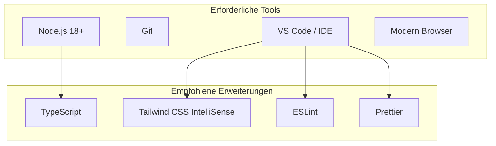
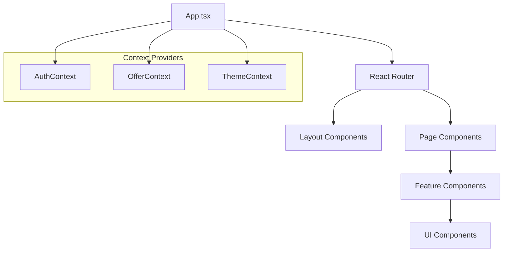
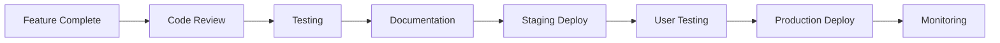

# Entwickler-Leitfaden

## Entwicklungsumgebung Setup

### Voraussetzungen



### Projekt-Setup

```bash
# Lovable-Projekt klonen/öffnen
# Keine lokale Installation erforderlich - alles läuft in der Cloud

# Für lokale Entwicklung (optional):
git clone <repository-url>
cd ki-angebotssystem
npm install
npm run dev
```

## Code-Struktur & Architektur

### Ordner-Struktur

```
src/
├── components/          # React-Komponenten
│   ├── chat/           # Chat-spezifisch
│   ├── offers/         # Angebots-Management
│   ├── appointment/    # Terminbuchung
│   ├── auth/          # Authentifizierung
│   ├── admin/         # Admin-Panel
│   ├── layout/        # Layout-Komponenten
│   └── ui/            # Wiederverwendbare UI
├── contexts/           # React Contexts
├── hooks/             # Custom Hooks
├── integrations/      # External APIs
├── lib/              # Utilities
├── pages/            # Route-Komponenten
├── services/         # Business Logic
└── types/            # TypeScript Types
```

### Komponenten-Hierarchie



## Entwicklungs-Standards

### 1. Naming Conventions

```typescript
// Komponenten: PascalCase
export const ChatInterface = () => {};

// Hooks: camelCase mit "use" Prefix
export const useAuth = () => {};

// Services: camelCase
export const chatService = {};

// Konstanten: UPPER_SNAKE_CASE
const MAX_MESSAGE_LENGTH = 500;

// Typen/Interfaces: PascalCase
interface ChatMessage {
  id: string;
  content: string;
}
```

### 2. File-Struktur Pattern

```typescript
// Component File Structure
import { useState, useEffect } from 'react';
import { Button } from '@/components/ui/button';
import { useAuth } from '@/contexts/AuthContext';

interface ComponentProps {
  // Props definition
}

export const ComponentName = ({ prop }: ComponentProps) => {
  // Hooks
  const [state, setState] = useState();
  const { user } = useAuth();
  
  // Effects
  useEffect(() => {
    // Effect logic
  }, []);
  
  // Event Handlers
  const handleAction = () => {
    // Handler logic
  };
  
  // Render
  return (
    <div>
      {/* JSX */}
    </div>
  );
};
```

### 3. TypeScript Guidelines

```typescript
// Strenge Type-Definitionen
interface StrictInterface {
  required: string;
  optional?: number;
  readonly immutable: boolean;
}

// Union Types für begrenzte Werte
type Status = 'pending' | 'approved' | 'rejected';

// Generics für wiederverwendbare Typen
interface APIResponse<T> {
  data: T;
  error?: string;
  loading: boolean;
}

// Utility Types nutzen
type PartialUser = Partial<User>;
type RequiredFields = Required<Pick<User, 'id' | 'email'>>;
```

## Komponenten-Entwicklung

### 1. Component-Pattern

```typescript
// Basis-Template für neue Komponenten
import React from 'react';
import { cn } from '@/lib/utils';

interface MyComponentProps {
  className?: string;
  children?: React.ReactNode;
  variant?: 'default' | 'secondary';
  size?: 'sm' | 'md' | 'lg';
}

export const MyComponent = ({ 
  className,
  children,
  variant = 'default',
  size = 'md',
  ...props 
}: MyComponentProps) => {
  return (
    <div 
      className={cn(
        'base-styles',
        {
          'variant-default': variant === 'default',
          'variant-secondary': variant === 'secondary',
          'size-sm': size === 'sm',
          'size-md': size === 'md',
          'size-lg': size === 'lg',
        },
        className
      )}
      {...props}
    >
      {children}
    </div>
  );
};
```

### 2. Custom Hooks Pattern

```typescript
// Custom Hook für API-Calls
export const useApiData = <T>(endpoint: string) => {
  const [data, setData] = useState<T | null>(null);
  const [loading, setLoading] = useState(true);
  const [error, setError] = useState<string | null>(null);
  
  useEffect(() => {
    const fetchData = async () => {
      try {
        setLoading(true);
        const response = await fetch(endpoint);
        const result = await response.json();
        setData(result);
      } catch (err) {
        setError(err instanceof Error ? err.message : 'Unknown error');
      } finally {
        setLoading(false);
      }
    };
    
    fetchData();
  }, [endpoint]);
  
  return { data, loading, error };
};
```

### 3. Context-Pattern

```typescript
// Context für globalen State
interface MyContextType {
  state: SomeState;
  actions: {
    updateState: (newState: SomeState) => void;
    resetState: () => void;
  };
}

const MyContext = createContext<MyContextType | undefined>(undefined);

export const MyProvider = ({ children }: { children: React.ReactNode }) => {
  const [state, setState] = useState<SomeState>(initialState);
  
  const actions = useMemo(() => ({
    updateState: (newState: SomeState) => setState(newState),
    resetState: () => setState(initialState),
  }), []);
  
  const value = useMemo(() => ({
    state,
    actions,
  }), [state, actions]);
  
  return (
    <MyContext.Provider value={value}>
      {children}
    </MyContext.Provider>
  );
};

export const useMyContext = () => {
  const context = useContext(MyContext);
  if (!context) {
    throw new Error('useMyContext must be used within MyProvider');
  }
  return context;
};
```

## API-Integration

### 1. Service-Layer Pattern

```typescript
// services/apiService.ts
class APIService {
  private baseURL: string;
  
  constructor(baseURL: string) {
    this.baseURL = baseURL;
  }
  
  async request<T>(endpoint: string, options?: RequestInit): Promise<T> {
    const url = `${this.baseURL}${endpoint}`;
    
    const response = await fetch(url, {
      headers: {
        'Content-Type': 'application/json',
        ...options?.headers,
      },
      ...options,
    });
    
    if (!response.ok) {
      throw new Error(`API Error: ${response.statusText}`);
    }
    
    return response.json();
  }
  
  async get<T>(endpoint: string): Promise<T> {
    return this.request<T>(endpoint);
  }
  
  async post<T>(endpoint: string, data: any): Promise<T> {
    return this.request<T>(endpoint, {
      method: 'POST',
      body: JSON.stringify(data),
    });
  }
}

export const apiService = new APIService('/api');
```

### 2. Supabase-Integration

```typescript
// services/supabaseService.ts
import { supabase } from '@/integrations/supabase/client';

export class SupabaseService {
  async select<T>(table: string, query?: string): Promise<T[]> {
    let queryBuilder = supabase.from(table).select(query || '*');
    
    const { data, error } = await queryBuilder;
    
    if (error) {
      throw new Error(`Supabase error: ${error.message}`);
    }
    
    return data || [];
  }
  
  async insert<T>(table: string, data: Partial<T>): Promise<T> {
    const { data: result, error } = await supabase
      .from(table)
      .insert(data)
      .select()
      .single();
    
    if (error) {
      throw new Error(`Insert error: ${error.message}`);
    }
    
    return result;
  }
  
  async update<T>(table: string, id: string, data: Partial<T>): Promise<T> {
    const { data: result, error } = await supabase
      .from(table)
      .update(data)
      .eq('id', id)
      .select()
      .single();
    
    if (error) {
      throw new Error(`Update error: ${error.message}`);
    }
    
    return result;
  }
  
  async delete(table: string, id: string): Promise<void> {
    const { error } = await supabase
      .from(table)
      .delete()
      .eq('id', id);
    
    if (error) {
      throw new Error(`Delete error: ${error.message}`);
    }
  }
}
```

## State Management

### 1. React Query Integration

```typescript
// hooks/useApiQuery.ts
import { useQuery, useMutation, useQueryClient } from '@tanstack/react-query';

export const useOffers = () => {
  return useQuery({
    queryKey: ['offers'],
    queryFn: () => offersService.getAll(),
    staleTime: 5 * 60 * 1000, // 5 Minuten
  });
};

export const useCreateOffer = () => {
  const queryClient = useQueryClient();
  
  return useMutation({
    mutationFn: (offer: CreateOfferData) => offersService.create(offer),
    onSuccess: () => {
      queryClient.invalidateQueries({ queryKey: ['offers'] });
    },
    onError: (error) => {
      console.error('Error creating offer:', error);
    },
  });
};
```

### 2. Lokaler State mit Zustand

```typescript
// stores/useStore.ts
import { create } from 'zustand';
import { devtools, persist } from 'zustand/middleware';

interface AppState {
  // State
  theme: 'light' | 'dark';
  sidebarOpen: boolean;
  
  // Actions
  setTheme: (theme: 'light' | 'dark') => void;
  toggleSidebar: () => void;
}

export const useAppStore = create<AppState>()(
  devtools(
    persist(
      (set) => ({
        theme: 'light',
        sidebarOpen: false,
        
        setTheme: (theme) => set({ theme }),
        toggleSidebar: () => set((state) => ({ 
          sidebarOpen: !state.sidebarOpen 
        })),
      }),
      {
        name: 'app-store',
      }
    )
  )
);
```

## Testing-Strategien

### 1. Unit Tests

```typescript
// __tests__/components/Button.test.tsx
import { render, screen, fireEvent } from '@testing-library/react';
import { Button } from '@/components/ui/button';

describe('Button', () => {
  it('renders with correct text', () => {
    render(<Button>Click me</Button>);
    expect(screen.getByText('Click me')).toBeInTheDocument();
  });
  
  it('calls onClick handler when clicked', () => {
    const handleClick = jest.fn();
    render(<Button onClick={handleClick}>Click me</Button>);
    
    fireEvent.click(screen.getByText('Click me'));
    expect(handleClick).toHaveBeenCalledTimes(1);
  });
  
  it('applies custom className', () => {
    render(<Button className="custom-class">Button</Button>);
    expect(screen.getByText('Button')).toHaveClass('custom-class');
  });
});
```

### 2. Integration Tests

```typescript
// __tests__/integration/ChatFlow.test.tsx
import { render, screen, fireEvent, waitFor } from '@testing-library/react';
import { QueryClient, QueryClientProvider } from '@tanstack/react-query';
import { ChatInterface } from '@/components/chat/ChatInterface';

const queryClient = new QueryClient({
  defaultOptions: {
    queries: { retry: false },
    mutations: { retry: false },
  },
});

const Wrapper = ({ children }: { children: React.ReactNode }) => (
  <QueryClientProvider client={queryClient}>
    {children}
  </QueryClientProvider>
);

describe('Chat Flow', () => {
  it('sends message and receives response', async () => {
    render(<ChatInterface onOfferGenerated={jest.fn()} />, { wrapper: Wrapper });
    
    const input = screen.getByPlaceholderText(/Beschreiben Sie Ihre Bedürfnisse/);
    const sendButton = screen.getByRole('button', { name: /send/i });
    
    fireEvent.change(input, { target: { value: 'Test message' } });
    fireEvent.click(sendButton);
    
    await waitFor(() => {
      expect(screen.getByText('Test message')).toBeInTheDocument();
    });
  });
});
```

### 3. E2E Tests

```typescript
// cypress/e2e/offer-creation.cy.ts
describe('Offer Creation Flow', () => {
  beforeEach(() => {
    cy.visit('/');
    cy.login('test@example.com', 'password');
  });
  
  it('creates offer from chat conversation', () => {
    // Start chat
    cy.get('[data-testid="chat-input"]').type('I need a website');
    cy.get('[data-testid="send-button"]').click();
    
    // Wait for AI response
    cy.get('[data-testid="ai-message"]').should('be.visible');
    
    // Continue conversation
    cy.get('[data-testid="chat-input"]').type('Budget is 5000 EUR');
    cy.get('[data-testid="send-button"]').click();
    
    // Request offer
    cy.get('[data-testid="create-offer-button"]').click();
    
    // Verify offer is displayed
    cy.get('[data-testid="offer-display"]').should('be.visible');
    cy.get('[data-testid="offer-total"]').should('contain', '€');
  });
});
```

## Performance-Optimierung

### 1. React Performance

```typescript
// Memoization für teure Berechnungen
const ExpensiveComponent = ({ data }: { data: LargeDataSet }) => {
  const processedData = useMemo(() => {
    return processLargeDataSet(data);
  }, [data]);
  
  const handleClick = useCallback((id: string) => {
    // Handler logic
  }, []);
  
  return (
    <div>
      {processedData.map(item => (
        <Item 
          key={item.id} 
          data={item} 
          onClick={handleClick}
        />
      ))}
    </div>
  );
};

// Memoized Component
const Item = React.memo(({ data, onClick }: ItemProps) => {
  return (
    <div onClick={() => onClick(data.id)}>
      {data.name}
    </div>
  );
});
```

### 2. Code Splitting

```typescript
// Route-basiertes Code Splitting
import { lazy, Suspense } from 'react';

const OffersPage = lazy(() => import('@/pages/Offers'));
const AppointmentPage = lazy(() => import('@/pages/Appointment'));

const App = () => {
  return (
    <Router>
      <Routes>
        <Route path="/offers" element={
          <Suspense fallback={<div>Loading...</div>}>
            <OffersPage />
          </Suspense>
        } />
      </Routes>
    </Router>
  );
};
```

### 3. Bundle-Optimierung

```typescript
// vite.config.ts
export default defineConfig({
  build: {
    rollupOptions: {
      output: {
        manualChunks: {
          vendor: ['react', 'react-dom'],
          ui: ['@radix-ui/react-dialog', '@radix-ui/react-select'],
          utils: ['date-fns', 'clsx', 'tailwind-merge'],
        },
      },
    },
  },
});
```

## Debugging & Troubleshooting

### 1. Development Tools

```typescript
// Debug Utilities
export const debug = {
  log: (message: string, data?: any) => {
    if (process.env.NODE_ENV === 'development') {
      console.log(`[DEBUG] ${message}`, data);
    }
  },
  
  error: (message: string, error?: any) => {
    console.error(`[ERROR] ${message}`, error);
  },
  
  performance: (label: string, fn: () => void) => {
    const start = performance.now();
    fn();
    const end = performance.now();
    console.log(`[PERF] ${label}: ${end - start}ms`);
  },
};
```

### 2. Error Boundaries

```typescript
// components/ErrorBoundary.tsx
interface ErrorBoundaryState {
  hasError: boolean;
  error?: Error;
}

export class ErrorBoundary extends Component<
  { children: ReactNode },
  ErrorBoundaryState
> {
  constructor(props: { children: ReactNode }) {
    super(props);
    this.state = { hasError: false };
  }
  
  static getDerivedStateFromError(error: Error): ErrorBoundaryState {
    return { hasError: true, error };
  }
  
  componentDidCatch(error: Error, errorInfo: ErrorInfo) {
    console.error('Error caught by boundary:', error, errorInfo);
  }
  
  render() {
    if (this.state.hasError) {
      return (
        <div className="error-boundary">
          <h2>Something went wrong.</h2>
          <details>
            {this.state.error?.message}
          </details>
        </div>
      );
    }
    
    return this.props.children;
  }
}
```

### 3. Logging & Monitoring

```typescript
// utils/logger.ts
class Logger {
  private context: string;
  
  constructor(context: string) {
    this.context = context;
  }
  
  info(message: string, data?: any) {
    console.log(`[${this.context}] ${message}`, data);
  }
  
  error(message: string, error?: any) {
    console.error(`[${this.context}] ${message}`, error);
    
    // In production: send to monitoring service
    if (process.env.NODE_ENV === 'production') {
      this.sendToMonitoring('error', message, error);
    }
  }
  
  private sendToMonitoring(level: string, message: string, data?: any) {
    // Implementation für Monitoring-Service
  }
}

export const createLogger = (context: string) => new Logger(context);
```

## Contribution Guidelines

### 1. Git Workflow

```bash
# Feature Branch erstellen
git checkout -b feature/new-chat-feature

# Commits mit aussagekräftigen Messages
git commit -m "feat(chat): add message persistence"
git commit -m "fix(auth): resolve token refresh issue"
git commit -m "docs(api): update endpoint documentation"

# Pull Request erstellen
git push origin feature/new-chat-feature
```

### 2. Code Review Checklist

- [ ] **Funktionalität**: Feature funktioniert wie spezifiziert
- [ ] **Tests**: Neue Tests für neue Funktionalität
- [ ] **TypeScript**: Keine Type-Errors
- [ ] **Performance**: Keine Performance-Regressionen
- [ ] **Accessibility**: ARIA-Labels und Keyboard-Navigation
- [ ] **Documentation**: Code ist dokumentiert
- [ ] **Security**: Keine Sicherheitslücken

### 3. Release Process



## Nächste Schritte

1. 📋 [Zurück zur Übersicht](./README.md)
2. 🚀 Mit der Entwicklung beginnen
3. 📚 Weitere Dokumentation lesen

### Hilfreiche Ressourcen

- **React Docs**: https://react.dev
- **TypeScript Handbook**: https://typescriptlang.org/docs
- **Tailwind CSS**: https://tailwindcss.com/docs
- **Supabase Docs**: https://supabase.io/docs
- **Lovable Docs**: https://docs.lovable.dev
